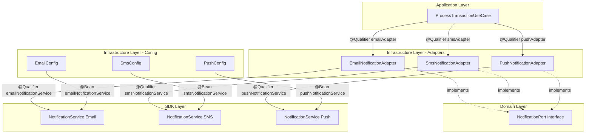

# PinApp Transaction Gateway

> **Financial Transaction Processor & Notification Orchestrator**


---

## 📋 Overview

**PinApp Transaction Gateway** es un microservicio crítico diseñado para orquestar el procesamiento de transacciones financieras. Su responsabilidad principal es interpretar el estado de cada transacción y decidir la estrategia de notificación más adecuada para el cliente final, integrándose nativamente con la librería core `pinapp-notify-sdk`.

Este proyecto sirve como una **implementación de referencia de Arquitectura Hexagonal**, demostrando cómo desacoplar completamente la lógica de negocio (Domain) de los frameworks y detalles de infraestructura.

---

## 🏛️ Arquitectura y Diseño

El servicio sigue estrictamente los principios de **Clean Architecture**:

*   **Domain (Java Puro)**: Contiene la lógica de negocio, reglas y modelos. No tiene dependencias de Spring ni de librerías externas.
*   **Infrastructure (Spring Boot)**: Implementa los adaptadores que conectan el dominio con el mundo exterior (API REST, SDKs, Bases de Datos).

### 🔌 Specialized Outbound Adapters

El sistema implementa una arquitectura de **Adaptadores Especializados** donde cada canal de notificación (Email, SMS, Push) tiene su propio puerto de salida y su propia configuración independiente.

#### 🛡️ Fault Isolation

Esta arquitectura proporciona **aislamiento de fallos** (Fault Isolation):

*   Si la configuración de Email falla, los canales SMS y Push continúan operativos.
*   Cada adaptador es independiente y autocontenido, con su propio `NotificationService` configurado.
*   Los fallos en un canal no afectan la disponibilidad de los demás.

#### 📐 Estructura de Adaptadores

Cada canal implementa la interfaz `NotificationPort` pero con su propia especialización:

```
NotificationPort (Interface)
├── EmailNotificationAdapter (@Component("emailAdapter"))
│   └── @Qualifier("emailNotificationService")
├── SmsNotificationAdapter (@Component("smsAdapter"))
│   └── @Qualifier("smsNotificationService")
└── PushNotificationAdapter (@Component("pushAdapter"))
    └── @Qualifier("pushNotificationService")
```

#### ⚙️ Configuración Distribuida

Las credenciales y configuraciones se gestionan mediante `application.yml` de Spring Boot, inyectadas mediante `@Value` en clases `@Configuration` específicas por canal:

*   **EmailConfig**: Inyecta `pinapp.notify.email.*`
*   **SmsConfig**: Inyecta `pinapp.notify.sms.*`
*   **PushConfig**: Inyecta `pinapp.notify.push.*`

Cada configuración crea su propio bean `NotificationService` con el nombre único correspondiente, permitiendo que Spring resuelva correctamente las dependencias mediante `@Qualifier`.

#### 🔄 Extensibilidad (Open/Closed Principle)

Para agregar un nuevo canal de notificación (ej. Slack, WhatsApp), solo se requiere:

1. **Crear un nuevo Port** en `domain.ports.out` (si es necesario extender la interfaz)
2. **Crear un nuevo Adapter** implementando `NotificationPort` con `@Component("slackAdapter")`
3. **Crear una nueva Config** con `@Configuration` que inyecte las propiedades desde `application.yml`
4. **Registrar el bean** con un nombre único (ej. `slackNotificationService`)
5. **Actualizar el Use Case** para inyectar el nuevo adaptador mediante `@Qualifier`

Este diseño cumple el **Principio Abierto/Cerrado (OCP)**: abierto para extensión, cerrado para modificación.

### 📏 Reglas de Negocio (Business Rules)

El Gateway decide el canal de notificación basándose en el estado final de la transacción:

| Transaction Status | Notification Channel | Estrategia | Prioridad |
| :--- | :--- | :--- | :--- |
| **COMPLETED** | 📧 **Email** | Síncrono | Crítica (Alta) |
| **PENDING** | 📲 **Push** | Asíncrono (Batch) | Baja (No Bloqueante) |
| **REJECTED** | 💬 **SMS** | Síncrono | Seguridad (Alertas) |

### 📊 Diagrama de Inyección de Dependencias

El siguiente diagrama muestra cómo el `ProcessTransactionUseCase` inyecta los tres adaptadores especializados mediante `@Qualifier`:



**Notas del Diagrama:**
- Cada adaptador está anotado con `@Component` y un nombre único (emailAdapter, smsAdapter, pushAdapter)
- Cada configuración crea un bean `NotificationService` con nombre único mediante `@Bean`
- Los `@Qualifier` en los edges muestran cómo Spring resuelve las dependencias

**Flujo de Ejecución:**

1. El `ProcessTransactionUseCase` recibe una `Transaction` con un estado (COMPLETED, PENDING, REJECTED).
2. Según el estado, selecciona el adaptador correspondiente mediante el switch.
3. El adaptador especializado mapea la transacción al modelo del SDK y envía la notificación.
4. Cada adaptador utiliza su propio `NotificationService` configurado independientemente.

---

## 🚀 Getting Started

### Prerrequisitos

*   ☕ **Java 21** (Eclipse Temurin recomendado)
*   🐘 **Maven 3.9+**
*   🐳 **Docker** (para containerización)

### Instalación

Esta aplicación depende de `pinapp-notify-sdk`. Se asume que el SDK se encuentra en un directorio hermano:

```text
/workspace
  ├── pinapp-notify-sdk/         <-- Source del SDK
  └── pinapp-transaction-gateway/ <-- Este proyecto
```

### 🛠️ Uso del Makefile

Hemos simplificado el ciclo de desarrollo usando `make`. Comandos disponibles:

```bash
make install-sdk   # 📦 Compila e instala la librería SDK localmente
make build         # 🏗️ Compila el gateway (libs + source)
make run           # ▶️ Levanta la aplicación en local
make docker-build  # 🐳 Genera la imagen Docker automáticamente (incluye SDK)
make docker-run    # 🏃 Ejecuta el contenedor en puerto 8080
make docker-stop   # 🛑 Detiene el contenedor en ejecución
make docker-clean  # 🧹 Elimina la imagen y limpia archivos temporales
```

---

## 🐳 Docker Demo

¿No tienes Java instalado o quieres probar una versión limpia? Utiliza nuestra infraestructura Dockerizada.

El script de automatización se encarga de todo (compilar SDK, empaquetar y construir imagen).

```bash
# 1. Construir la imagen
make docker-build

# 2. Ejecutar la demo
make docker-run
```

La aplicación estará disponible en `http://localhost:8080`.

---

## 🔌 API Reference

Documentación interactiva disponible vía Swagger UI:
👉 **[http://localhost:8080/swagger-ui.html](http://localhost:8080/swagger-ui.html)**

### Endpoints Principales

| Método | Endpoint | Descripción |
| :--- | :--- | :--- |
| `POST` | **/v1/transactions** | **Procesamiento Unitario**. Recibe una transacción, evalúa reglas y notifica síncronamente (si aplica). |
| `POST` | **/v1/transactions/batch** | **Procesamiento Batch**. Ingesta masiva de transacciones para procesamiento diferido/asíncrono. |
| `GET` | **/v1/transactions/status/{id}** | **Consulta de Estado**. Verifica el estatus de notificaciones asíncronas pendientes. |

---

## 📂 Estructura del Proyecto

```text
pinapp-transaction-gateway/
├── domain/                      # 🧠 NÚCLEO (Sin dependencias de framework)
│   ├── model/                   # Entidades (Transaction, NotificationStatus)
│   ├── ports/
│   │   ├── in/                  # Puertos de entrada (TransactionService)
│   │   └── out/                 # Puertos de salida (NotificationPort)
│   └── application/
│       └── usecase/              # Casos de uso (ProcessTransactionUseCase)
├── infrastructure/              # 🔌 ADAPTADORES (Spring Boot)
│   ├── notification/            # Adaptadores especializados
│   │   ├── EmailNotificationAdapter
│   │   ├── SmsNotificationAdapter
│   │   ├── PushNotificationAdapter
│   │   └── TransactionAuditListener
│   ├── config/                  # Configuraciones por canal
│   │   ├── EmailConfig          # @Bean emailNotificationService
│   │   ├── SmsConfig            # @Bean smsNotificationService
│   │   ├── PushConfig           # @Bean pushNotificationService
│   │   └── SwaggerConfig
│   ├── rest/                    # Controllers REST
│   └── store/                   # Implementación de persistencia
├── src/main/resources/
│   ├── application.yml          # Configuración de credenciales por canal
│   └── META-INF/
│       └── additional-spring-configuration-metadata.json
├── Dockerfile                   # 🐳 Multistage Build Definition
├── Makefile                     # 🛠️ Task Runner
└── prepare_docker.sh            # 📜 Automation Script
```

### 📝 Configuración de Credenciales

Las credenciales se gestionan en `application.yml`:

```yaml
pinapp:
  notify:
    email:
      provider: "sendgrid"
      api-key: "SG.your_api_key_here"
    sms:
      provider: "twilio"
      account-sid: "AC_your_account_sid_here"
    push:
      provider: "firebase"
      server-key: "FK_your_server_key_here"
    retry-attempts: 2
```

Cada clase de configuración (`EmailConfig`, `SmsConfig`, `PushConfig`) inyecta estas propiedades mediante `@Value` y crea su propio bean `NotificationService` especializado.

---

<div align="center">
  <sub>Built with ❤️ by PinApp DevOps Team</sub>
</div>
